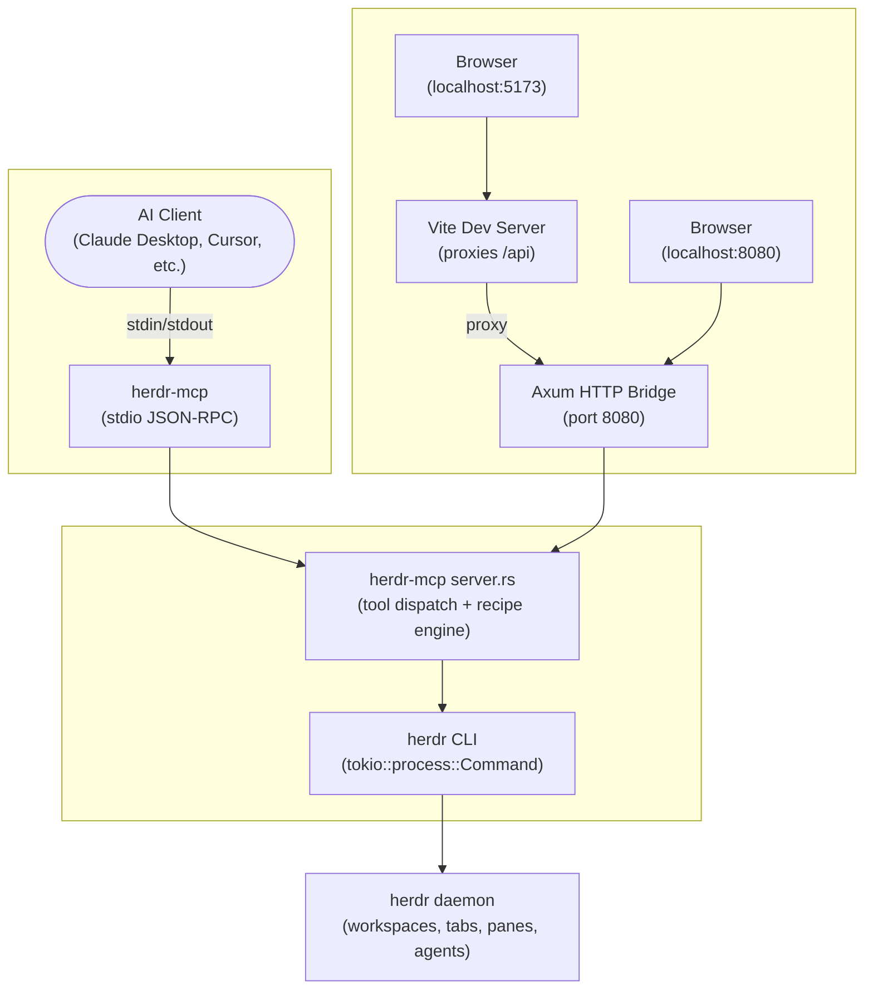

[](LICENSE)
[](https://rustup.rs/)
[](https://github.com/herdr-mcp)

# herdr-mcp

MCP (Model Context Protocol) server written in Rust that exposes [herdr](https://herdr.dev) — a terminal-native agent multiplexer — as tools.

**HTTP bridge + interactive web playground** included: run individual tools or chain them into multi-step recipes with variable passing, all from a browser.

- [Quick start](#quick-start)
- [Features](#features)
- [Architecture](#architecture)
- [Install & build](#install--build)
- [Usage](#usage)
  - [MCP mode](#mcp-mode)
  - [HTTP + web playground](#http--web-playground)
  - [HTTP API](#http-api)
  - [Recipe format](#recipe-format)
  - [Environment](#environment)
- [Tools (21)](#tools-21)
- [Development](#development)
- [Contributing](#contributing)
- [License](#license)

---

## Quick start

```bash
cargo build --release
./target/release/herdr-mcp
```

Requires the `herdr` CLI on `PATH` ([install](https://herdr.dev)).

For the web playground:

```bash
cargo build --release
./target/release/herdr-mcp --http 8080 --http-only
# Open http://localhost:8080/
```

---

## Features

- **MCP mode** — plug into any MCP-compatible client (Claude Desktop, Cursor, Claude Code, Continue) to control herdr workspaces, tabs, panes, and agents
- **HTTP bridge** — built-in Axum HTTP server enables browser-based interaction
- **Web playground** — full React UI for exploring and invoking tools, building recipes, and inspecting results
- **21 tools** — discovery, lifecycle, read, write, and synchronize operations against herdr
- **Recipe engine** — chain multiple tool calls with variable interpolation (`{{ stepId.result.path }}`)
- **No external dependencies** beyond herdr itself — shells out to the CLI via `tokio::process::Command`

---

## Architecture



The server is a thin wrapper that shells out to the local `herdr` CLI binary. It supports two transport modes:

- **MCP stdio** — communicates over stdin/stdout using JSON-RPC, compatible with all MCP clients
- **HTTP bridge** — runs alongside the MCP server when `--http <port>` is provided; the web playground communicates over HTTP

**Why shell out instead of speaking the socket protocol directly?** Herdr's wire protocol isn't publicly documented and may change; the CLI is the stable, documented surface. Zero coupling, easy to keep up to date.

### Project structure

```
herdr-mcp/
├── src/
│   ├── main.rs          # Binary entrypoint — MCP stdio + optional HTTP bridge
│   ├── server.rs        # 21 MCP tools, HTTP bridge, recipe engine, CLI helpers
│   ├── main.tsx         # React entrypoint (Vite + Tailwind + TypeScript)
│   ├── App.tsx          # HashRouter: landing / docs / playground
│   ├── components/      # Landing page + Documentation + Playground components
│   └── recipes/         # Prebuilt recipe definitions
├── Cargo.toml           # Rust crate — rmcp, axum, clap, tokio
├── package.json         # Vite + React 19 + Tailwind 4 + react-router-dom + @dnd-kit
├── vite.config.ts       # vite-plugin-singlefile, /api proxy → localhost:8080
└── index.html
```

Rust and TypeScript files share the same `src/` directory.

---

## Install & build

### Prerequisites

- [Rust](https://rustup.rs/) 1.75+
- [herdr](https://herdr.dev) CLI on `PATH`
- [Node.js](https://nodejs.org/) 20+ (only needed for website development)

### Build from source

```bash
git clone <repo-url>
cd herdr-mcp

# Build the MCP server binary
cargo build --release

# Build the website (optional — single HTML file)
npm install
npm run build
```

### CLI flags

| Flag | Description |
|------|-------------|
| `--http <port>` | Start HTTP bridge on given port |
| `--http-only` | Run HTTP server only (skip MCP stdio transport) |

---

## Usage

### MCP mode

```bash
./target/release/herdr-mcp
```

Add to your MCP client config:

```json
{
  "mcpServers": {
    "herdr-mcp": {
      "command": "/path/to/herdr-mcp"
    }
  }
}
```

### HTTP + web playground

```bash
# Start server with HTTP bridge (skips MCP stdio)
./target/release/herdr-mcp --http 8080 --http-only
# Open http://localhost:8080/
```

For development with hot-reload on the website:

```bash
# Terminal 1: Rust HTTP server
cargo run --release -- --http 8080 --http-only

# Terminal 2: Vite dev server (proxies /api → localhost:8080)
npm run dev

# Open http://localhost:5173/
```

### HTTP API

All endpoints return JSON.

| Method | Path | Description |
|--------|------|-------------|
| `GET` | `/api/health` | Health check → `"ok"` |
| `GET` | `/api/tools` | List all 21 tools with JSON schemas |
| `POST` | `/api/tools/:name` | Invoke a tool by name, body is the parameter object |
| `POST` | `/api/recipe` | Execute a multi-step recipe with variable interpolation |

### Recipe format

```json
{
  "name": "optional name",
  "steps": [
    {
      "id": "step1",
      "tool": "list_workspaces",
      "params": {},
      "description": "Get workspaces"
    },
    {
      "id": "step2",
      "tool": "read_pane",
      "params": {
        "pane_id": "{{ step1.result.content[0].workspaces[0].active_tab_id }}",
        "source": "visible"
      },
      "description": "Read first pane"
    }
  ]
}
```

Variables are resolved from previous step results using `{{ stepId.result.path }}` syntax with dot/bracket navigation.

### Environment

| Variable | Default | Description |
|----------|---------|-------------|
| `HERDR_BIN` | `herdr` | Path to herdr CLI binary |
| `RUST_LOG` | `herdr_mcp=info` | Tracing filter |

---

## Tools (21)

### Discovery
| Tool | Description |
|------|-------------|
| `status` | Get overall herdr server status |
| `list_workspaces` | List all workspaces |
| `list_tabs` | List tabs (optionally by workspace) |
| `list_panes` | List panes (optionally by workspace) |
| `list_agents` | List all detected agents |
| `get_pane` | Get pane details by pane_id or label |
| `get_agent` | Get agent details |

### Lifecycle
| Tool | Description |
|------|-------------|
| `create_workspace` | Create a new workspace |
| `create_tab` | Create a new tab |
| `split_pane` | Split a pane right or down (by pane_id or label) |
| `close_pane` | Close a pane by pane_id or label |
| `start_agent` | Start an agent in a new pane |

### Read
| Tool | Description |
|------|-------------|
| `read_pane` | Read output from a pane (by pane_id or label) |
| `read_agent` | Read output from an agent |

### Write
| Tool | Description |
|------|-------------|
| `send_text` | Send text to a pane (no Enter, by pane_id or label) |
| `send_keys` | Send key presses to a pane (by pane_id or label) |
| `run_command` | Run a command in a pane (text + Enter, by pane_id or label) |
| `send_agent` | Send text to an agent |

### Synchronize
| Tool | Description |
|------|-------------|
| `wait_output` | Wait for specific output in a pane (by pane_id or label) |
| `wait_pane_agent_status` | Wait for a pane's agent status (by pane_id or label) |
| `wait_agent_status` | Wait for an agent status by target |

**Important:** IDs are session-local and may compact when items are closed. Re-read IDs from list commands after structural changes.
All pane-targeting tools accept an optional `label` parameter as an alternative to `pane_id` — the server looks up the label via `herdr pane list` automatically.

---

## Development

See [AGENTS.md](AGENTS.md) for full agent-specific development conventions, build commands, and design notes.

```bash
# Terminal 1: Rust server with HTTP bridge
cargo run --release -- --http 8080 --http-only

# Terminal 2: Vite dev server
npm run dev
```

- Rust code lives in `src/server.rs` (all tool definitions, HTTP bridge, recipe engine, CLI helpers)
- Website is a single-page React app bundled via `vite-plugin-singlefile` into `dist/index.html`
- No test framework — zero tests
- `RUST_LOG` controls tracing verbosity

---

## Contributing

Please read [CONTRIBUTING.md](CONTRIBUTING.md) for details on the code of conduct and the pull request process.

All contributions must be certified via the [Developer Certificate of Origin (DCO)](https://github.com/apps/dco/).

---

## License

This project is licensed under the **GNU Affero General Public License v3.0** — see the [LICENSE](LICENSE) file for details.
