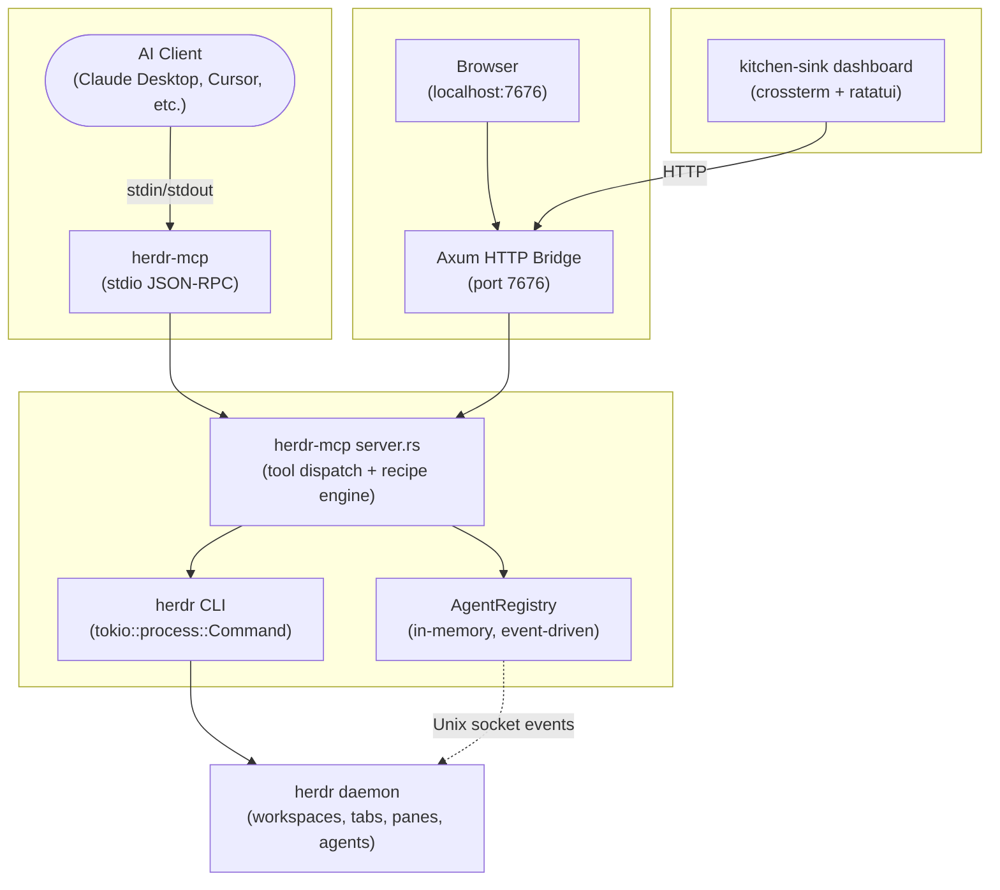

[](LICENSE)
[](https://rustup.rs/)
[](https://github.com/herdr-mcp)
[](https://github.com/herdr-mcp)
[](https://github.com/herdr-mcp)

# herdr-mcp

MCP (Model Context Protocol) server written in Rust that exposes [herdr](https://herdr.dev) — a terminal-native agent multiplexer — as tools.

**HTTP bridge + interactive web playground** included: run individual tools or chain them into multi-step recipes with variable passing, all from a browser.

- [Quick start](#quick-start)
- [Features](#features)
- [Architecture](#architecture)
- [Documentation](#documentation)
- [Install & build](#install--build)
- [Usage](#usage)
  - [MCP mode](#mcp-mode)
  - [HTTP + web playground](#http--web-playground)
  - [HTTP API](#http-api)
  - [Recipe format](#recipe-format)
  - [Environment](#environment)
- [Tools (49)](#tools-49)
- [Development](#development)
- [Contributing](#contributing)
- [License](#license)

---

## Quick start

```bash
cargo build --release
./target/release/herdr-mcp
```

Requires the `herdr` CLI on `PATH` ([install](https://herdr.dev)).

Running without any subcommand starts the MCP stdio server and the HTTP bridge
on port **7676** — open http://localhost:7676/ for the web playground.

### Other entry points

```bash
herdr-mcp serve        # explicit MCP + HTTP
herdr-mcp dashboard    # kitchen-sink TUI with mouse+keyboard nav
herdr-mcp trim         # one-shot message compression
herdr-mcp folder-key   # per-folder PFC1 key management
```

---

## Features

- **MCP mode** — plug into any MCP-compatible client (Claude Desktop, Cursor, Claude Code, Continue, OpenCode) to control herdr workspaces, tabs, panes, and agents
- **HTTP bridge** — built-in Axum HTTP server enables browser-based interaction
- **Web playground** — full React UI for exploring and invoking tools, building recipes, and inspecting results (served from the HTTP bridge itself, no separate dev server needed in production)
- **Kitchen-sink TUI** — VS Code-style tabbed terminal dashboard with mouse + keyboard navigation, trim analytics, variable editor, and settings
- **51 tools** — discovery, lifecycle, read, write, synchronize, a2a primitives, message-trim, recipe templates, scheduler, folder-key, and clipboard operations against herdr
- **Recipe engine** — chain multiple tool calls with variable interpolation (`{{ stepId.result.path }}`)
- **Message-trim pipeline** — `caveman` (lossy style) + `pfc1` (lossless Cherokee-syllabary phonetic) compressors for agent-to-agent comms
- **Per-pane trim policies** — attach staged compression pipelines to agents via `trim_policy_set`/`trim_policy_get`
- **Live agent registry** — Unix socket event subscriber tracks panes in real time; role/label resolution for a2a primitives
- **Cron-based scheduler** — schedule recipe runs on cron expressions
- **Per-folder PFC1 keys** — domain-specific compression keys built by scanning a folder
- **4-crate workspace** — `herdr-mcp-core`, `herdr-mcp-trim`, `herdr-mcp-server`, `herdr-mcp-cli` (299 tests, all passing)
- **No external dependencies** beyond herdr itself — shells out to the CLI via `tokio::process::Command`

---

## Architecture


```mermaid
graph TB
    subgraph MCP[" "]
        direction LR
        AI(["AI Client<br/>(Claude Desktop, Cursor, etc.)"])
        STDIO["herdr-mcp<br/>(stdio JSON-RPC)"]
        AI -- stdin/stdout --> STDIO
    end

    subgraph HTTP[" "]
        direction LR
        B1["Browser<br/>(localhost:7676)"]
        AXUM["Axum HTTP Bridge<br/>(port 7676)"]
        B1 --> AXUM
    end

    subgraph TUI[" "]
        DASH["kitchen-sink dashboard<br/>(crossterm + ratatui)"]
    end

    subgraph CORE[" "]
        TOOL["herdr-mcp server.rs<br/>(tool dispatch + recipe engine)"]
        CLI["herdr CLI<br/>(tokio::process::Command)"]
        REG["AgentRegistry<br/>(in-memory, event-driven)"]
    end

    STDIO --> TOOL
    AXUM --> TOOL
    DASH -->|HTTP| AXUM
    TOOL --> CLI
    TOOL --> REG
    CLI --> DAEMON["herdr daemon<br/>(workspaces, tabs, panes, agents)"]
    REG -.->|Unix socket events| DAEMON
```

The server is a thin wrapper that shells out to the local `herdr` CLI binary. It supports two transport modes:

- **MCP stdio** — communicates over stdin/stdout using JSON-RPC, compatible with all MCP clients
- **HTTP bridge** — runs alongside the MCP server when `--http <port>` is provided; the web playground communicates over HTTP

**Why shell out instead of speaking the socket protocol directly?** Herdr's wire protocol isn't publicly documented and may change; the CLI is the stable, documented surface. Zero coupling, easy to keep up to date.

### Project structure

```
herdr-mcp/
├── crates/
│   ├── herdr-mcp-core/      # Config system (TOML + env + CLI), error types
│   ├── herdr-mcp-trim/      # Message-trim pipeline (caveman, pfc1, folder keys, TUI dashboard)
│   ├── herdr-mcp-server/    # MCP server, 51 tools, HTTP bridge, recipe engine, event subscriber
│   └── herdr-mcp-cli/       # Binary entrypoint (serve/trim/dashboard/folder-key)
├── src/
│   ├── main.rs              # Legacy monolith binary entrypoint
│   ├── server.rs            # Legacy monolith server (coexists with crates)
│   ├── main.tsx             # React entrypoint (Vite + Tailwind + TypeScript)
│   ├── App.tsx              # HashRouter: landing / docs / playground / trim / variables
│   ├── components/          # Landing page + Documentation + Playground components
│   └── recipes/             # TypeScript recipe types for frontend
├── Cargo.toml               # 4-member workspace
├── package.json             # Vite + React 19 + Tailwind 4
├── vite.config.ts           # vite-plugin-singlefile, /api proxy
└── index.html
```

The 4-crate workspace is the canonical home for new code; the `src/` monolith
is legacy. See [docs/ARCHITECTURE.md](docs/ARCHITECTURE.md) for the full
reference.

---

## Documentation

| Document | Description |
|---|---|
| [docs/ARCHITECTURE.md](docs/ARCHITECTURE.md) | Comprehensive architecture reference: data flow, tool reference, HTTP API, recipe engine, trim system, agent registry, persistence, scheduler, frontend, dependencies, build/run, design decisions, known gotchas |
| [docs/PRD.md](docs/PRD.md) | Product requirements document |
| [AGENTS.md](AGENTS.md) | Cross-tool agent instructions for AI coding assistants (conventions, risk tiers, workflow, anti-patterns) |
| [compressorplan.md](compressorplan.md) | Message-trim design plan (caveman + pfc1) |
| [a2a.md](a2a.md) | Agent-to-agent primitive design and usage |
| [TEST_PLAN.md](TEST_PLAN.md) | Test suite specification (299 tests across 4 crates) |
| [herdmcp.toml](herdmcp.toml) | Persistent configuration (HTTP port, data dir, herdr socket) |

---

## Install & build

### Prerequisites

- [Rust](https://rustup.rs/) 1.75+
- [herdr](https://herdr.dev) CLI on `PATH`
- [Node.js](https://nodejs.org/) 20+ (only needed for website development)

### Build from source

```bash
git clone <repo-url>
cd herdr-mcp

# Build the MCP server binary
cargo build --release

# Build the website (optional — single HTML file)
npm install
npm run build
```

### Subcommands

| Subcommand | Description |
|------------|-------------|
| (no subcommand) | Run MCP stdio server + HTTP bridge on port 7676 |
| `serve` | Explicit MCP + HTTP with full flag control |
| `dashboard` | Kitchen-sink TUI (mouse+keyboard), runs on top of the serve stack |
| `trim` | One-shot message-trim pipeline on text or file |
| `folder-key` | Build/list/show/decompress per-folder PFC1 keys |

### Serve flags

| Flag | Description |
|------|-------------|
| `--http <port>` | HTTP bridge port (default: 7676) |
| `--http-only` | Skip MCP stdio, HTTP only |
| `--data-dir <path>` | Data directory (default: ./data) |
| `--herdr-socket <path>` | herdr daemon socket path |

### Dashboard flags

| Flag | Description |
|------|-------------|
| `--data-dir <path>` | Data directory (default: ./data) |
| `--http-port <port>` | HTTP bridge port for playground/live data (default: 7676) |
| `--legacy` | Run the legacy trim-only dashboard instead of the kitchen-sink TUI |

### Trim flags

| Flag | Description |
|------|-------------|
| `--stage <STAGE>` | Pipeline stage (e.g. `caveman:full`, `pfc1`); repeatable |
| `--decompress` | Reverse PFC1 compression |
| `--file <FILE>` | Read input from file |
| `<TEXT>` | Text to compress (trailing arguments) |

### Persistent configuration

Create a `herdmcp.toml` file in the working directory to set defaults:

```toml
# herdmcp.toml — Persistent configuration for herdr-mcp

[persistent]
http_port = 7676
data_dir = "./data"
herdr_socket = "~/.config/herdr/herdr.sock"
```

All settings are overridden by CLI flags and environment variables.

---

## Usage

### MCP mode + HTTP bridge (default)

```bash
./target/release/herdr-mcp
```

Starts MCP stdio transport **and** the HTTP bridge on port **7676**. The web
playground is available at http://localhost:7676/.

Add to your MCP client config:

```json
{
  "mcpServers": {
    "herdr-mcp": {
      "command": "/path/to/herdr-mcp"
    }
  }
}
```

### HTTP-only (no MCP)

```bash
./target/release/herdr-mcp serve --http-only
```

### Kitchen-sink dashboard

```bash
./target/release/herdr-mcp dashboard
```

Opens a VS Code-style tabbed TUI with mouse + keyboard navigation,
consolidating the overview, trim analytics, variable editor,
settings, and playground into a single herdr sidecar pane.

### Web playground (development with hot-reload)

```bash
# Terminal 1: Rust HTTP server
cargo run --release -- serve --http-only

# Terminal 2: Vite dev server (proxies /api → localhost:7676)
npm run dev

# Open http://localhost:5173/
```

### HTTP API

All endpoints return JSON. See [docs/ARCHITECTURE.md §5](docs/ARCHITECTURE.md#5-http-bridge-api) for the full route reference.

| Method | Path | Description |
|--------|------|-------------|
| `GET` | `/` | Web playground (serves the single-file React app) |
| `GET` | `/api/health` | Health check → `"ok"` |
| `GET` | `/api/tools` | List all 51 tools with JSON schemas |
| `POST` | `/api/tools/:name` | Invoke a tool by name, body is the parameter object |
| `GET` | `/api/agents?workspace_id=` | Live pane list from AgentRegistry (canonical) |
| `GET` | `/api/workspaces` | Workspace list via herdr CLI |
| `POST` | `/api/recipe` | Execute a multi-step recipe with variable interpolation |
| `GET` / `POST` | `/api/recipes` | List / create recipes |
| `GET` / `PUT` / `DELETE` | `/api/recipes/:id` | Get / update / delete a recipe |
| `POST` | `/api/recipes/:id/run` | Run a recipe by ID |
| `GET` / `POST` | `/api/variables` | List / save variables |
| `GET` / `DELETE` | `/api/variables/{key}` | Get / delete a variable |
| `GET` | `/api/trim/status?workspace_id=` | Aggregate trim savings |
| `POST` | `/api/trim/diagnose` | End-to-end trim readiness check |
| `POST` | `/api/trim/summary` | Fire savings summary notification |
| `POST` | `/api/trim/dashboard/open` | Open live dashboard in a herdr split pane |
| `GET` | `/api/executions/{id}` | Get recipe execution result |

### Recipe format

```json
{
  "name": "optional name",
  "steps": [
    {
      "id": "step1",
      "tool": "list_workspaces",
      "params": {},
      "description": "Get workspaces"
    },
    {
      "id": "step2",
      "tool": "read_pane",
      "params": {
        "pane_id": "{{ step1.result.content[0].workspaces[0].active_tab_id }}",
        "source": "visible"
      },
      "description": "Read first pane"
    }
  ]
}
```

Variables are resolved from previous step results using `{{ stepId.result.path }}` syntax with dot/bracket navigation.

### Environment

| Variable | Default | Description |
|----------|---------|-------------|
| `HERDR_BIN` | `herdr` | Path to herdr CLI binary |
| `HERDR_SOCKET_PATH` | `~/.config/herdr/herdr.sock` | herdr daemon socket |
| `RUST_LOG` | `herdr_mcp=info` | Tracing filter |
| `HERDR_MCP_DATA_DIR` | `./data` | Data directory override |
| `HERDR_MCP_HTTP_PORT` | — | HTTP bridge port override |
| `HERDR_MCP_HTTP_ONLY` | — | Set to disable MCP stdio |
| `HERDR_MCP_HTTP_BIND` | `0.0.0.0` | HTTP bind address |
| `HERDR_MCP_CONFIG` | — | Config file path |
| `HERDR_MCP_TOOL_TIMEOUT` | — | Tool call timeout in seconds |
| `HERDR_MCP_MAX_CONCURRENT` | — | Max concurrent tool calls |
| `HERDR_MCP_HERDR_TIMEOUT` | — | herdr CLI timeout in seconds |
| `HERDR_MCP_CLIPBOARD_COPY` | — | Clipboard copy command |
| `HERDR_MCP_CLIPBOARD_PASTE` | — | Clipboard paste command |
| `HERDR_MCP_LOG_LEVEL` | — | Log level override |
| `HERDR_MCP_LOG_FORMAT` | — | Log format (full, compact, json) |
| `HERDR_MCP_PFC1_MAX_SYMBOLS` | 85 | Max PFC1 Cherokee symbols |
| `HERDR_MCP_PFC1_ENABLE_PHRASES` | — | Enable multi-word PFC1 phrases |

---

## Tools (51)

Full parameter reference: [docs/ARCHITECTURE.md §4](docs/ARCHITECTURE.md#4-mcp-tool-reference-51-tools-total).

### Discovery (7)
| Tool | Description |
|------|-------------|
| `status` | Get overall herdr server status |
| `list_workspaces` | List all workspaces |
| `list_tabs` | List tabs (optionally by workspace) |
| `list_panes` | List panes (optionally by workspace) |
| `list_agents` | List all detected agents |
| `get_pane` | Get pane details by pane_id or label |
| `get_agent` | Get agent details |

### Lifecycle (5)
| Tool | Description |
|------|-------------|
| `create_workspace` | Create a new workspace |
| `create_tab` | Create a new tab |
| `split_pane` | Split a pane right or down (by pane_id or label) |
| `close_pane` | Close a pane by pane_id or label |
| `start_agent` | Start an agent in a new pane |

### Read (2) / Write (4)
| Tool | Description |
|------|-------------|
| `read_pane` | Read output from a pane (by pane_id or label) |
| `read_agent` | Read output from an agent |
| `send_text` | Send text to a pane (no Enter, by pane_id or label) |
| `send_keys` | Send key presses to a pane (by pane_id or label) |
| `run_command` | Run a command in a pane (text + Enter, by pane_id or label) |
| `send_agent` | Send text to an agent |

### Synchronize (3)
| Tool | Description |
|------|-------------|
| `wait_output` | Wait for specific output in a pane (by pane_id or label) |
| `wait_pane_agent_status` | Wait for a pane's agent status (by pane_id or label) |
| `wait_agent_status` | Wait for an agent status by target |

### A2A primitives (5)
| Tool | Description |
|------|-------------|
| `agent_spawn` | Spawn agent, register role→pane, wait for deps, capture output |
| `agent_message` | Send message with optional trim; honors per-pane policy |
| `agent_read` | Read + store as work product; auto-decompress PFC1 |
| `agent_wait` | Wait for agent by role/pane |
| `agent_list` | List registry agents |

### Session variables (2) / Message-trim (10) / Recipes (3) / Scheduler (4) / Folder-key (4) / Clipboard (2)
| Tool | Description |
|------|-------------|
| `var_get` / `var_set` | Get / set session variable |
| `compress` / `decompress` | PFC1/Caveman trim round-trip |
| `trim_policy_get` / `trim_policy_set` | Read / attach trim policy on agent |
| `trim_eval` / `trim_bench` / `trim_status` / `trim_diagnose` / `trim_summary` / `trim_dashboard_open` | Trim analytics & dashboards |
| `list_templates` / `get_template` / `instantiate_template` | Bundled recipe templates |
| `schedule_recipe` / `list_schedules` / `delete_schedule` / `enable_schedule` | Cron-based recipe scheduling |
| `build_folder_key` / `get_folder_key` / `list_folder_keys` / `decompress_with_folder_key` | Per-folder PFC1 keys |
| `clipboard_get` / `clipboard_set` | System clipboard access |

**Important:** IDs are session-local and may compact when items are closed. Re-read IDs from list commands after structural changes.
All pane-targeting tools accept an optional `label` parameter as an alternative to `pane_id` — the server looks up the label via `herdr pane list` automatically.

---

## Development

See [AGENTS.md](AGENTS.md) for full agent-specific development conventions, build commands, and design notes. See [docs/ARCHITECTURE.md](docs/ARCHITECTURE.md) for the comprehensive architecture reference.

```bash
# Terminal 1: Rust server with HTTP bridge
cargo run --release -- --http 8080 --http-only

# Terminal 2: Vite dev server
npm run dev

# Full test suite (299 tests across 4 crates)
cargo test --workspace

# Lint + format check
cargo clippy --all-targets -- -D warnings
cargo fmt --all -- --check
```

- Rust code lives in `crates/` (4-crate workspace); legacy `src/` monolith also present
- Website is a single-page React app bundled via `vite-plugin-singlefile` into `dist/index.html`
- 299 tests across 4 crates (all passing): `herdr-mcp-trim` (169), `herdr-mcp-server` (82), `herdr-mcp-core` (38), `herdr-mcp-cli` (10)
- `RUST_LOG` controls tracing verbosity; stdout is reserved for MCP JSON-RPC (stderr for logs)

---

## Contributing

Please read [CONTRIBUTING.md](CONTRIBUTING.md) for details on the code of conduct and the pull request process.

All contributions must be certified via the [Developer Certificate of Origin (DCO)](https://github.com/apps/dco/).

---

## License

This project is licensed under the **GNU Affero General Public License v3.0** — see the [LICENSE](LICENSE) file for details.
